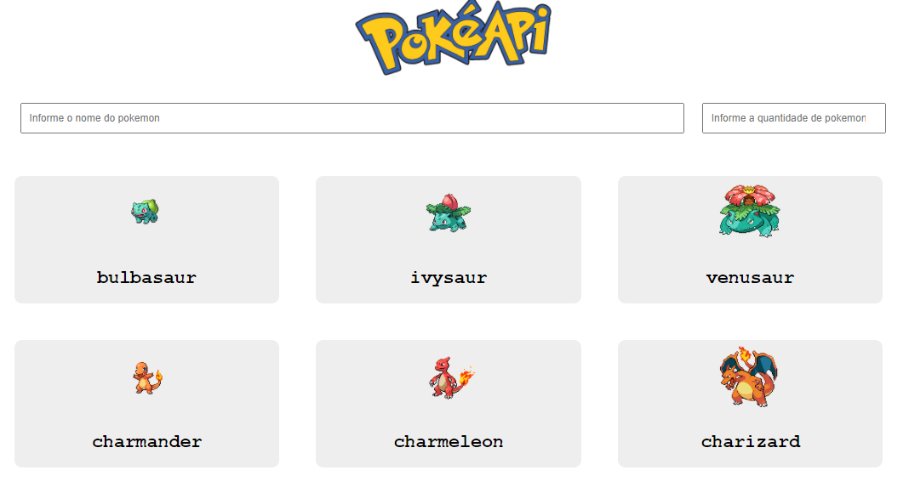
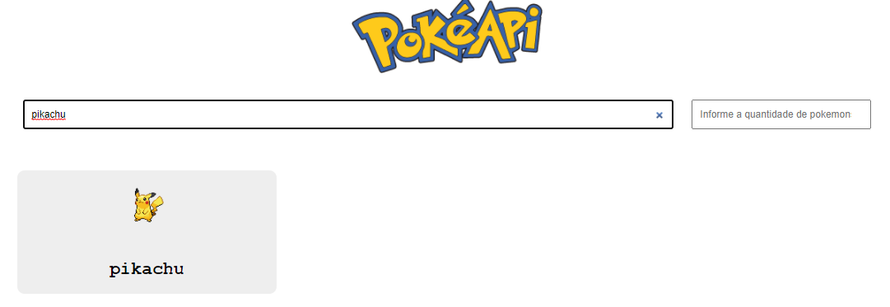

  

 

    Pokedex criada em HTML, CSS e Javascript puro sem uso de uma biblioteca, consumindo uma api onde é possível encontrar informações de vários pokemons.

 

    
    Aplicação inicialmente busca 10 pokemons na pokeApi e os lista na tela.

 

    
    É possível filtrar os pokemons por nome ou quantidade.

